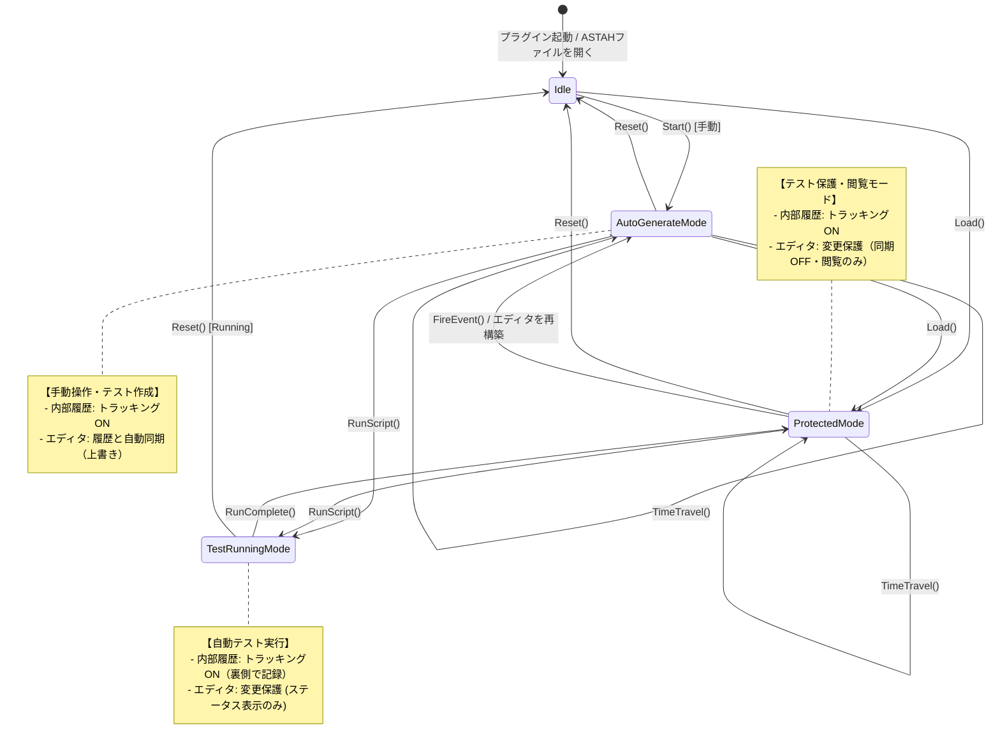

# Stm Lens for astah* 設計書

## 1. アーキテクチャ
astah* Plug-in SDKを利用したJavaプラグインとして実装する。
MVC (Model-View-Controller) パターンを適用し、状態マシンのロジックとUI表示を分離する。

## 2. クラス構成 (パッケージ: snytng.astah.plugin.stm)

### 2.1. View (UI層) - `actions` / `ui` package
*   **`StmAnalysisView`**: プラグインのエントリーポイントとなるメインパネル。`BorderLayout`を採用。
    *   全体のレイアウトから不要な `TitledBorder` を廃止し、フラットなデザインとする。
    *   **Top (Control Panel)**: 1行に基本操作を集約。
        *   `[Start]`, `[Reset]`, ナビゲーションボタン (`[|<<]`, `[<]`, `[>]`, `[>>|]`) とステップ表示。
        *   `Fast Mode` チェックボックス, `Show Actions` チェックボックス, `[Copy Debug]` ボタン。
        *   `[▼ Test Tools]` トグルボタン: 押下すると Test Panel が表示/非表示になる。ラベルは状態に応じて変化する（▲/▼）。
    *   **Test Panel (折りたたみ領域)**: トップパネル直下に配置。デフォルトは非表示。テスト関連の機能を統合。
        *   **Test Button Panel**: スクリプトの保存・管理を行うボタン群（Save, Load 等）と、保存済みテストケースを選択するコンボボックスを配置。
        *   **Script Control Bar**: スクリプトエリアの直上に配置。コンパクトな `[▶ Run Script]` ボタンと、テスト結果を常時一目で確認できるステータスラベル（`Ready`, `Running...`, `PASSED`, `FAILED`）を並べる。アクションを対象の近くに置く「局所性の原則」に基づくIDEライクな設計。
        *   **Test Scripting Panel (JSplitPane)**: テキストベースの自動テスト用エリア。左側にスクリプト入力欄（`JTextArea`）、右側に結果表示欄（`JTextArea`）を左右均等分割（HORIZONTAL_SPLIT）で配置。入力と結果を見比べやすくしつつ、画面の縦幅の無駄な占有を防ぐ。
    *   **Center (JSplitPane)**: イベントボタンエリアとログエリアを左右に分割配置する。
        *   **Left (Events Panel)**: イベントボタンを動的に配置する領域。
        *   **Right (Log Panel)**: ログ出力エリア (`JTextArea`)。

### 2.2. Model (ロジック層) - `model` package
*   **`SimulationSnapshot`** (新規): ある時点でのエンジンの状態を保持するクラス。
    *   保持するデータ: `currentVertices`, `previousVertices`, `historyMap`, `entryTimeMap`, `lastTransition`, その時点までの出力ログのテキストなど。これらの安全なコピーを保持する。
*   **`SimulationEngine`**: シミュレーションの中核ロジック。
    *   `historySnapshots`: `List<SimulationSnapshot>`。実行履歴を保持するリスト。
    *   `currentSnapshotIndex`: `int`。現在表示中のスナップショットのインデックス。
    *   `saveSnapshot()`: 現在の状態からスナップショットを作成し、リストに追加する。
    *   `restoreSnapshot(int index)`: 指定インデックスのスナップショットを読み込み、状態を復元する。
    *   `currentVertices`: 現在アクティブな `IVertex` のリスト（平行状態対応のため複数保持）。
    *   `historyMap`: 各複合状態(`IState`)において、最後にアクティブだった直下の子状態(`IVertex`)を保持するマップ。履歴状態(`H`, `H*`)の復元に使用。
    *   `entryTimeMap`: 各状態(`IVertex`)に進入した時刻(`System.currentTimeMillis()`)を保持するマップ。タイマーイベントの残り時間計算に使用する。
    *   `executionLog`: シミュレーションの実行履歴（ログテキストまたは構造化データ）を保持する。
    *   `start(IStateMachineDiagram)`: 図から初期状態を探して開始。
    *   `getAvailableTransitions()`: 現在の状態から遷移可能な `ITransition` のリストを返す。親状態も含め、通常の遷移（`getOutgoings()`）に加え、内部遷移（`getInternalTransitions()`）も収集する。その際、astah* APIの仕様により `getOutgoings()` の結果に内部遷移が混入するため、重複を排除するフィルタリングを行う。
    *   `step(ITransition)`: 指定された遷移を実行し、遷移結果（アクションログ等）と新しいカレントステートを返す。
    *   `scheduleTimeEvent(long delay, Runnable callback)`: 時間イベントをスケジュールする（タイマー管理）。
    *   **複合状態対応ロジック**:
        *   `findLCA(IVertex source, IVertex target)`: 遷移元と遷移先の共通の親（Least Common Ancestor）を特定する。
        *   `executeExitChain(IVertex current, IVertex lca)`: 現在の状態からLCAまでのExitアクションを順に実行する。**この際、退出する複合状態に対して、現在のアクティブな子状態を `historyMap` に記録する。**
        *   `executeEntryChain(IVertex target, IVertex lca)`: LCAからターゲットまでのEntryアクションを順に実行する。
*   **`DiagramHighlighter`**: astah* API (`IDiagramViewManager`) を使用して、現在の状態、直前の状態、遷移をハイライトするヘルパークラス。
    *   `highlightAvailableTransitions(Map<ITransition, Color> transitionColors)`: 遷移可能な遷移を指定された色でハイライトする。

### 2.3. Utility
*   **`TimerManager`**: 時間イベントのスケジューリングとキャンセルを管理する。Swingのタイマーまたは `java.util.Timer` をラップし、UIスレッドでのイベント発火を保証する。
    *   `setMode(TimerMode mode)`: 実時間/高速モードを設定する。
*   **`TestManager`**: テストケースの記録・保存・再生を管理する。
    *   （役割の変更）: 旧来の遷移IDリストを用いた自前の記録・再生ロジックは廃止し、テキストスクリプトのタグ付き値への保存・読み込み管理に特化する。
    *   `saveTestCase(String name, String scriptText, IStateMachine stateMachine)`: テキストスクリプトをタグ付き値に保存する。
    *   `loadTestCases(IStateMachine stateMachine)`: 保存されているテストスクリプトのマップ（名前 -> スクリプト文字列）を読み込む。

## 3. 動的構造（処理フロー）

### 3.1. シミュレーション開始フロー
1.  ユーザーが [Start] ボタンを押下。
2.  `StmAnalysisView` が `SimulationEngine.start()` を呼び出す。
3.  `SimulationEngine` は `IStateMachineDiagram` から `InitialPseudostate` を探索。
4.  初期状態からの遷移を辿り、最初の `State` を特定して `currentVertex` に設定。
5.  `DiagramHighlighter` が初期状態をハイライト。
6.  `StmAnalysisView` が `getAvailableTransitions()` を呼び出し、イベントボタンを生成して表示。
    *   この際、各遷移に色を割り当て、ボタンと図上の遷移線を同じ色で表示するよう `DiagramHighlighter` に指示する。

### 3.2. イベント発火フロー
1.  ユーザーがイベントボタンを押下。
2.  `StmAnalysisView` が `SimulationEngine.fire(transition)` を呼び出す。
3.  `SimulationEngine` は `step(transition)` を実行し、状態を更新する。
    *   **内部遷移の判定**: 遷移が内部遷移（`source.getInternalTransitions()` に含まれる）であるか判定する。内部遷移の場合は、状態の退出・進入・更新処理をスキップし、遷移自身の `Action` のみを実行して処理を終了する。
    *   **複合状態の考慮**:
        1.  遷移元(`source`)と遷移先(`target`)のLCAを特定。
        2.  `source` から `lca` までのExitアクションを実行（記録）。**この時 `entryTimeMap` からエントリを削除する。**
        3.  遷移自体のActionを実行（記録）。
        4.  `lca` から `target` までのEntryアクションを実行（記録）。
        5.  `target` が複合状態の場合、内部の初期状態(`InitialPseudostate`)を探索し、そこからの遷移を自動実行（再帰的にEntry/Doを実行）。
4.  `DiagramHighlighter` が古い状態のハイライトを解除し、新しい状態をハイライト。
5.  **タイマー処理**: 新しい状態に時間イベント(`tm`)を持つ遷移がある場合、`TimerManager` にタイマーをセットする。
6.  `StmAnalysisView` がログエリアに遷移履歴を追記。
7.  `StmAnalysisView` がイベントボタンリストを更新（次の状態で可能なイベントに差し替え）。
    *   **並行状態の同時遷移**: 同じイベントトリガーを持つ遷移が複数のリージョンで可能な場合、それらをまとめて実行するロジックとする。
### 3.3. 条件分岐（ジャンクション/選択）の処理
*   **遷移候補の探索 (`getAvailableTransitions`)**:
    *   遷移先が `Junction` または `Choice` の場合、そこで止まらずにその先の遷移（Outgoing）を再帰的に探索する。
    *   ユーザーには、分岐点を超えた最終的な遷移先ごとの選択肢（ボタン）として提示する（例: `Trigger [x>0]`, `Trigger [else]`）。

### 3.4. 時間イベント（タイマー）の処理
*   **自動発火**: 状態遷移後、`tm(msec)` が定義された遷移がある場合、タイマーを開始。時間が経過すると自動的にイベントが発火し、遷移が実行される。
    *   **残り時間の計算**: `tm(msec) - (現在時刻 - entryTimeMap.get(state))` を計算し、最短の残り時間でタイマーをセットする。これにより、他のリージョンが遷移しても、タイマーのカウントダウンはリセットされない。
*   **高速モード**: 高速モードが有効な場合、指定された `msec` を無視し、即時（または最小遅延）でイベントを発火させる。
*   **手動介入**: UI上に「タイマー待ち」の状態を表示し、ユーザーが [Skip Wait] ボタン等を押すことで、時間を待たずに即座に発火させることも可能にする（デバッグ効率化のため）。
*   **キャンセル**: タイムアウト前に別のイベントで遷移した場合、セットされていたタイマーはキャンセルされる。

### 3.5. テスト記録・再生の処理
*   **リアルタイム記録 (Record)**:
    *   ユーザーが [Record] ボタンを押すと記録モードになり、スクリプトエディタに `Target:` や `AssertState:` が初期出力される。
    *   イベント遷移実行後、`Fire: <イベント名>` と現在の `AssertState:` がエディタの末尾に自動追記される。
    *   タイムトラベル操作で過去に戻った場合、記録モードは自動的に停止される。
*   **一括生成 (Generate)**:
    *   ユーザーが [Generate] ボタンを押すと、`SimulationEngine` の履歴（`historySnapshots`）の先頭から現在地までを走査する。
    *   実行された各遷移（イベント）と、その時点でのカレントステートから、テストスクリプト全体を構築してエディタに出力する。
*   **保存と再生**:
    *   [Save] でエディタのテキストをそのままモデルに保存する。
    *   再生は、テキストベースの自動テスト機能（T30で実装済み）のパース＆実行エンジンに委ねられる。旧来の遷移IDリストを用いた再生ロジックは破棄する。

### 3.8. タイムトラベルデバッグフロー
1.  **スナップショットの保存**: `SimulationEngine.start()` および `step()` が正常に完了した直後に、エンジンの内部状態のコピーを作成し (`saveSnapshot`)、履歴リストに保存する。この時、`currentSnapshotIndex` がリストの末尾でない（過去に戻っている）場合は、インデックス以降の古い未来の履歴を削除してから追加する。
2.  **ナビゲーション操作**:
    *   ユーザーがUIのナビゲーションボタンを押下する。
    *   `StmAnalysisView` が `SimulationEngine` の対応するメソッド（例: `stepBack()`）を呼び出す。
3.  **状態の復元**:
    *   `SimulationEngine` は履歴リストから該当する `SimulationSnapshot` を取り出す。
    *   エンジンの内部変数をスナップショットの値で上書きする（`currentSnapshotIndex` も更新）。
4.  **UIの更新**:
    *   `StmAnalysisView` が更新された状態を取得し、画面表示（状態ラベル、ボタン、ハイライト、ログ）をリフレッシュする。

### 3.7. 異常状態検知フロー
1.  `SimulationEngine.step()` の処理完了後、内部状態の整合性チェック (`validateCurrentStates()`) を実行する。
2.  チェック項目:
    *   非並行状態（または並行状態内の同一リージョン）で、アクティブなカレントステートが複数存在しないか。
    *   カレントステートが喪失していないか（正常な終了状態は除く）。
3.  矛盾を検知した場合、`SimulationEngine` は `IllegalSimulationStateException` をスローする。
4.  `StmAnalysisView` はこの例外をキャッチし、エラーダイアログを表示してシミュレーションを停止状態にする。

### 3.6. タイマーモード切替フロー
1.  ユーザーがUI上の [Fast Mode] チェックボックスを操作する。
2.  `StmAnalysisView` が `SimulationEngine.setFastMode()` を呼び出す。
3.  `SimulationEngine` は `TimerManager` のモードを更新した後、`checkTimers()` を再度呼び出す。
4.  `checkTimers()` は、現在スケジュールされているタイマーをキャンセルし、新しいモードに基づいてタイマーを再スケジュールする。
    *   **Normal → Fast**: 待機中のタイマーが即時発火する。
    *   **Fast → Normal**: （即時発火済みのため、実質的な影響はない）

### 3.9. UIモードの状態遷移 (メタ・ステートマシン)
本プラグインのUI状態（モード）は、ユーザーの手動操作（テスト作成）と自動テストの実行・デバッグを直感的に切り替えるため、以下のステートマシンとして設計されている。

